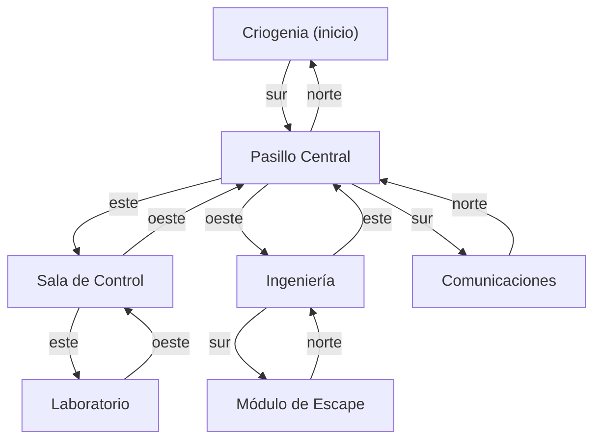
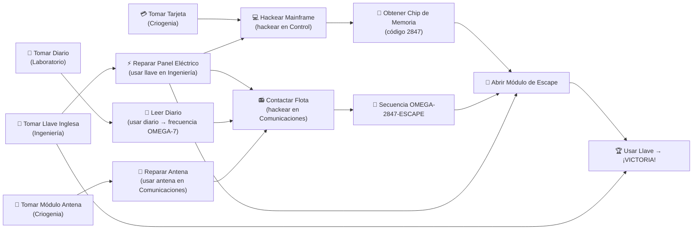

# Expansión Narrativa y de Puzzles — Odisea en la Estación Espacial

## Contexto Actual

El juego tiene **7 salas** conectadas así:



**Problema actual**: El jugador solo necesita coger la Llave Inglesa en Ingeniería, ir al Módulo de Escape y usarla. No hay cadena de puzzles, ni uso significativo de Comunicaciones, Laboratorio o Control.

---

## Diseño Narrativo Expandido

### La Premisa

La tripulación de la estación fue evacuada de emergencia tras un fallo catastrófico. El **Módulo de Escape** quedó **sellado con un protocolo de seguridad de 3 factores** que requiere:

1. **Un código numérico** (almacenado en el Mainframe de Control)
2. **Una frecuencia de desbloqueo** (transmitida desde el exterior vía el Terminal de Comunicaciones)
3. **Reparación física del panel de acceso** (requiere la Llave Inglesa en Ingeniería)

El jugador debe visitar **todas las salas clave** y completar tareas en un orden lógico para reunir los 3 factores.

---

## Nuevos Objetos (4 adicionales)

| # | Objeto | ID | Ubicación | Propósito |
|---|--------|----|-----------|-----------|
| 1 | **Llave Inglesa** | `llave` | Ingeniería | Reparar el panel eléctrico averiado en Ingeniería para restaurar energía a los sistemas |
| 2 | **Tarjeta de Acceso** | `tarjeta` | Criogenia | Desbloquear el Mainframe de la Sala de Control (requiere autorización física) |
| 3 | **Diario del Capitán** *(NUEVO)* | `diario` | Laboratorio | Contiene una anotación críptica: *"La frecuencia de auxilio es OMEGA-7. Úsala en el terminal de comunicaciones."* |
| 4 | **Chip de Memoria** *(NUEVO)* | `chip` | Sala de Control | Se obtiene al hackear el Mainframe con la tarjeta. Contiene el código numérico `2847` |
| 5 | **Módulo de Antena** *(NUEVO)* | `antena` | Criogenia | Pieza de repuesto para reparar la antena rota de Comunicaciones |
| 6 | **Tanque de Oxígeno** | `tanque` | Sala de Control | Proporciona +60 segundos de oxígeno (sin cambios) |

> [!NOTE]
> El **Chip de Memoria** no es un objeto que se encuentre en el suelo. Se *genera* como recompensa al usar `hackear` en Control con la Tarjeta de Acceso en el inventario. Esto demuestra un uso significativo de JDBC.

---

## Flujo de Acertijos (Walkthrough Completo)

### Fase 1 — Criogenia (Sala Inicial)

```
El jugador despierta. Ve dos objetos en la sala:
  → Tarjeta de Acceso
  → Módulo de Antena
```

**Acciones:**
1. `mirar` → Descripción: *"Cápsulas criogénicas vacías. En el panel de la pared ves una tarjeta de acceso olvidada. Junto a los conductos, un módulo de antena de repuesto."*
2. `tomar tarjeta` → *"Tomaste: Tarjeta de Acceso"*
3. `tomar antena` → *"Tomaste: Módulo de Antena"*
4. `ir sur` → Pasillo Central

---

### Fase 2 — Ingeniería (Reparar la Energía)

```
El jugador va al oeste desde el Pasillo Central.
En Ingeniería hay: Llave Inglesa.
La sala tiene un panel eléctrico dañado que ha cortado la energía
a los sistemas de la estación.
```

**Acciones:**
1. `tomar llave` → *"Tomaste: Llave Inglesa"*
2. `usar llave` → **EN INGENIERÍA**: *"Usas la llave inglesa en el panel eléctrico dañado... ¡Chispas! Los circuitos se reconectan. La energía ha sido restaurada a los sistemas de la estación. Ahora puedes hackear las terminales en Control y Comunicaciones."*

**Efecto mecánico:** Se activa un flag `energiaRestaurada = true`. Antes de esto, intentar `hackear` en Control o Comunicaciones muestra: *"Los sistemas no tienen energía. Debes reparar algo primero."*

> [!IMPORTANT]
> La Llave Inglesa **no se consume** al usarla aquí. Se queda en el inventario porque también se necesitará más adelante.

---

### Fase 3 — Sala de Control (Obtener el Código)

```
El jugador va al este desde el Pasillo Central.
En Control hay: Tanque de Oxígeno.
Hay un Mainframe (ordenador central) que requiere la Tarjeta de Acceso.
```

**Acciones:**
1. `tomar tanque` → *"Tomaste: Tanque de Oxígeno"* (opcional, para ganar tiempo)
2. `hackear` → **CON Tarjeta en inventario Y energía restaurada**:
   - *"Insertas la Tarjeta de Acceso en el lector del Mainframe..."*
   - *"Accediendo a la base de datos del sistema central..."*
   - Se muestran registros de JDBC (logs de la tripulación):
     - *"LOG: Bitácora del Capitán — Día 47: El sistema de escape se bloqueó. Configuré el código de seguridad: 2847"*
     - *"LOG: Soporte vital crítico en sector 4. Evacuación inmediata."*
   - *"Has extraído un Chip de Memoria con el código del protocolo de seguridad."*
   - El `chip` se añade automáticamente al inventario.

**Sin Tarjeta:** *"El Mainframe requiere una tarjeta de autorización para acceder."*
**Sin energía:** *"La pantalla del Mainframe está apagada. No hay energía."*

---

### Fase 4 — Laboratorio (Descubrir la Frecuencia)

```
El jugador va al este desde Control.
En el Laboratorio hay: Diario del Capitán.
```

**Acciones:**
1. `tomar diario` → *"Tomaste: Diario del Capitán"*
2. `usar diario` → *"Abres el diario del Capitán. En la última página, con letra temblorosa, lees: 'Si alguien queda vivo... la frecuencia de auxilio para contactar con la flota de rescate es OMEGA-7. Transmítela desde Comunicaciones. Ellos tienen la secuencia final de desbloqueo.'"*

**Efecto mecánico:** Se activa un flag `frecuenciaDescubierta = true`. Esto permite que el comando `hackear` en Comunicaciones use la frecuencia correcta.

---

### Fase 5 — Comunicaciones (Contactar con el Exterior)

```
El jugador va al sur desde el Pasillo Central.
En Comunicaciones hay un terminal de radio.
Pero la antena está rota.
```

**Acciones:**
1. `usar antena` → **EN COMUNICACIONES**: *"Instalas el Módulo de Antena en el receptor dañado. ¡La señal se estabiliza! El terminal de comunicaciones está operativo."*
   - Se activa flag `antenaReparada = true`. Se consume el objeto `antena`.

2. `hackear` → **CON antena reparada, energía restaurada Y frecuencia descubierta**:
   - Se conecta vía **Sockets** al servidor local:
   - *"Conectando terminal intergaláctico en frecuencia OMEGA-7..."*
   - *"TRANSMISIÓN RECIBIDA: 'Aquí flota de rescate Artemis. Recibimos su señal. La secuencia de desbloqueo del Módulo de Escape es: OMEGA-2847-ESCAPE. Repito: OMEGA-2847-ESCAPE. Buena suerte.'"*
   - Se activa flag `secuenciaObtenida = true`.

**Sin antena:** *"La antena de comunicaciones está destrozada. No puedes transmitir nada."*
**Sin frecuencia:** *"El terminal pide una frecuencia de transmisión. No sabes cuál usar..."*
**Sin energía:** *"El terminal no tiene energía."*

---

### Fase 6 — Módulo de Escape (El Gran Final)

```
El jugador va al sur desde Ingeniería.
La puerta del Módulo de Escape está bloqueada con un protocolo de 3 factores.
```

**Acciones al intentar entrar `ir sur` desde Ingeniería:**

- **SIN todos los factores completados:** *"La compuerta del Módulo de Escape está sellada herméticamente. Un panel muestra: 'PROTOCOLO DE SEGURIDAD ACTIVO — Se requieren 3 factores de autenticación.' No puedes pasar."* → **El movimiento se bloquea.**

- **CON todos los factores (`energiaRestaurada` + `secuenciaObtenida` + `chip` en inventario):** *"La compuerta reconoce tus credenciales... Los 3 factores de seguridad se validan: ✓ Energía restaurada ✓ Chip de memoria insertado (Código: 2847) ✓ Secuencia de rescate confirmada (OMEGA-2847-ESCAPE). ¡Las compuertas se abren con un estruendo!"* → El jugador entra al Módulo de Escape.

**Una vez dentro del Módulo de Escape:**
- *"Entras en el Módulo de Escape. Las luces de emergencia parpadean en verde. La cápsula de evacuación está lista."*
- `usar llave` → *"Usas la Llave Inglesa para acoplar el panel de ignición... ¡SISTEMA EN LÍNEA! Los motores rugen. La cápsula se desprende de la estación. A través de la ventanilla ves cómo la estación se aleja en la oscuridad del espacio. ¡HAS ESCAPADO! ¡VICTORIA!"*
- Se guarda puntuación en la base de datos.

---

## Diagrama de Dependencias de los Puzzles



---

## Resumen del Orden Óptimo de Juego

| Paso | Sala | Acción | Resultado |
|------|------|--------|-----------|
| 1 | Criogenia | Tomar Tarjeta y Antena | Objetos clave para más adelante |
| 2 | Ingeniería | Tomar Llave Inglesa | Herramienta multiusos |
| 3 | Ingeniería | Usar Llave | ⚡ Restaura energía a toda la estación |
| 4 | Control | Hackear (con Tarjeta) | 💾 Obtienes Chip con código 2847 |
| 5 | Laboratorio | Tomar y Usar Diario | 📖 Descubres frecuencia OMEGA-7 |
| 6 | Comunicaciones | Usar Antena | 📡 Repara terminal de radio |
| 7 | Comunicaciones | Hackear | 📻 Obtienes secuencia OMEGA-2847-ESCAPE |
| 8 | Módulo de Escape | Entrar (puerta se abre) | 🚪 Los 3 factores se validan |
| 9 | Módulo de Escape | Usar Llave | 🚀 **¡VICTORIA!** |

> [!TIP]
> El jugador no tiene que seguir este orden exacto. Puede explorar libremente. Lo que importa es que tenga todos los requisitos antes de intentar entrar al Módulo de Escape. Esto permite rejugabilidad.

---

## Propuesta de Cambios Técnicos

### GameState

#### [MODIFY] [GameState.java](file:///c:/Users/Usuario/Desktop/Programacion/programacion/src/main/java/di/uniba/map/b/adventure/core/GameState.java)
- Añadir 4 flags booleanos: `energiaRestaurada`, `frecuenciaDescubierta`, `antenaReparada`, `secuenciaObtenida`

---

### GameEngine

#### [MODIFY] [GameEngine.java](file:///c:/Users/Usuario/Desktop/Programacion/programacion/src/main/java/di/uniba/map/b/adventure/core/GameEngine.java)
- **`crearMapa()`**: Añadir los 3 nuevos objetos (diario, chip, antena) en sus salas. Actualizar descripciones de las salas.
- **`mover()`**: Bloquear acceso al Módulo de Escape si no se tienen los 3 factores.
- **`usar()`**: Expandir con lógica para cada nuevo objeto y sus condiciones por sala:
  - `usar llave` en Ingeniería → reparar energía
  - `usar diario` en cualquier sala → revelar frecuencia
  - `usar antena` en Comunicaciones → reparar antena
  - `usar llave` en Escape → victoria final
- **`hackear()`**: Expandir Control (requiere tarjeta + energía → genera chip) y Comunicaciones (requiere antena + energía + frecuencia → da secuencia final)

---

### NetworkTerminal

#### [MODIFY] [NetworkTerminal.java](file:///c:/Users/Usuario/Desktop/Programacion/programacion/src/main/java/di/uniba/map/b/adventure/net/NetworkTerminal.java)
- Cambiar el mensaje del servidor para devolver la secuencia de desbloqueo: *"OMEGA-2847-ESCAPE"*

---

### DBManager

#### [MODIFY] [DBManager.java](file:///c:/Users/Usuario/Desktop/Programacion/programacion/src/main/java/di/uniba/map/b/adventure/db/DBManager.java)
- Añadir más logs de la tripulación, incluyendo uno con el código `2847`
- Añadir método `getLogWithCode()` que devuelve específicamente el log con el código

---

### Stanza

#### [MODIFY] [Stanza.java](file:///c:/Users/Usuario/Desktop/Programacion/programacion/src/main/java/di/uniba/map/b/adventure/entities/Stanza.java)
- Añadir setter para `descripcion` (para poder actualizarla dinámicamente cuando se reparan cosas)

---

## Verificación

### Pruebas manuales
1. **Camino feliz**: Seguir el walkthrough completo y verificar victoria
2. **Bloqueo del Módulo de Escape**: Intentar entrar sin los 3 factores → debe bloquearse
3. **Orden libre**: Intentar hackear Control sin tarjeta/energía → mensajes de error correctos
4. **Guardar/Cargar**: Guardar a mitad del puzzle, cargar y verificar que los flags se mantienen

> [!IMPORTANT]
> ## Preguntas para el usuario
> 1. ¿Te parece bien que la **Llave Inglesa** se use dos veces (reparar energía + victoria final) o prefieres que solo se use una vez?
> 2. ¿Quieres que las descripciones de las salas cambien dinámicamente tras las reparaciones? (ej: "Los monitores ahora muestran datos" en vez de "Monitores parpadeantes")
> 3. ¿Prefieres que el jugador deba escribir manualmente la secuencia "OMEGA-2847-ESCAPE" como un acertijo extra, o que se valide automáticamente al tener los flags?
